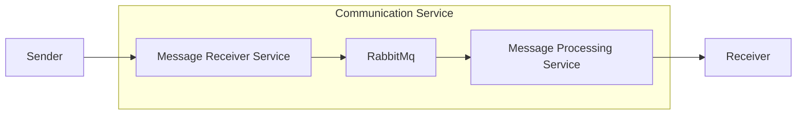
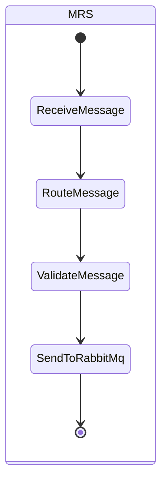

# Message receiver service

The `Message receiver service` or also referred as `MRS` is responsible for receiving messages through a REST API and
then based on the channel type, it will
determine the appropriate routing and send the message to RabbitMq.

# Design

# Message Receiver Service

## Dataflow

### ReceiveMessage

This message is received through a REST API.
The API documentation is available at http://localhost:8080/swagger-ui/index.html.

### RouteMessage

This step determines the channel type of the message and based on that, it will route the message to the appropriate
queue in RabbitMq.

| Channel Type | Route                      |
|--------------|----------------------------|
| TEAMS        | messages.channel.teams.add |
| SLACK        | messages.channel.slack.add |
| EMAIL        | messages.channel.email.add |

### ValidateMessage

Before the message is sent to RabbitMq, it is validated to ensure that all required fields are present. Each object has
schema defined that is used to validate the message.

### SendToRabbitMq

Finally, the message is sent to RabbitMq using the appropriate routing key based on the channel type. The meessage is
then ready to be processed by the `Message Processing Service` (MPS).